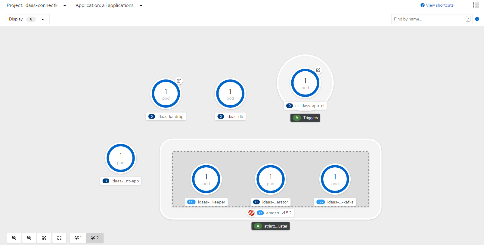
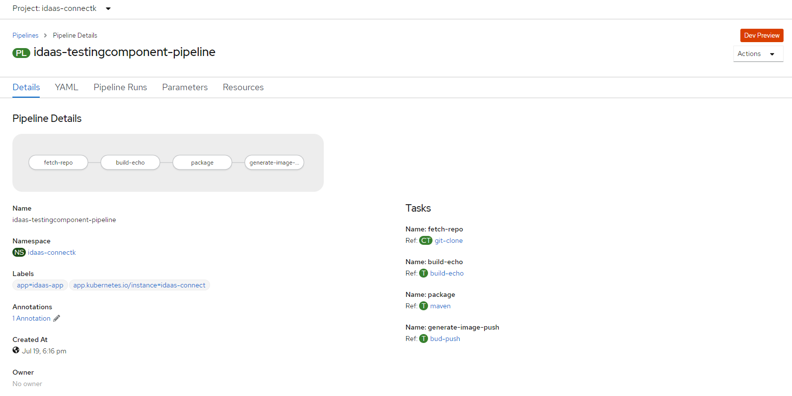
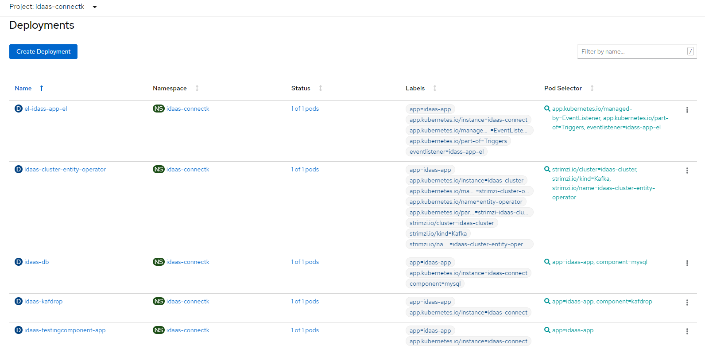
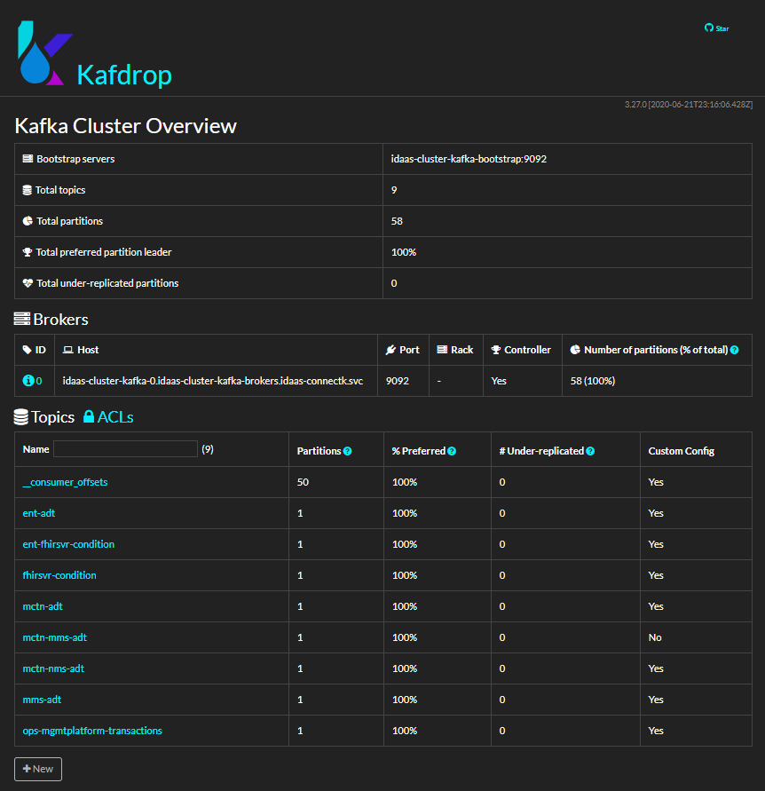
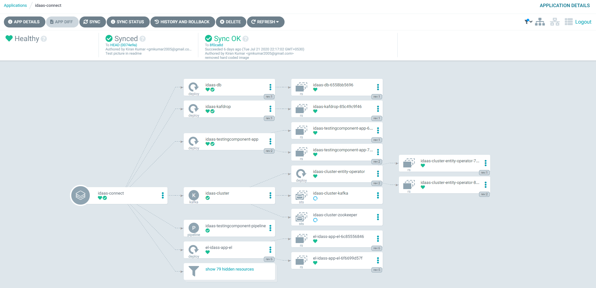

# idaas-connect-gitops

# About idaas-connect-gitops 
_**idaas-connect-gitops**_  is an opensource project developed by Parkar Consulting Group which automates deployment of iDaas components on to OpenShift. It helps developer teams quickly get started with the healthcare projects utilizing RedHat Openshift platform. Customizable to your project requirements.

## _iDaas_ : 
RedHat Intelligent Data as a Service (iDaaS) address data management requirements for  healthcare organizations , an architecture that can process data from
various sources and route information to a wide variety of new destinations.  It provides inbound connectors, message consumption, a business rules engine, an action engine, federated access to data sources, caching, and outbound connectors.

Following components will be deployed using idaas-connect-gitops
1)	Minimal Kafka with single cluster and single zookeeper uses openshift operator.
2)	Kafka Topics -  Minimal set of topics needed for iDaas TestingComponent
3)	iDaas TestingComponent --  A Java application which is a demo  application demonstrating key architectural aspects of iDaas 
4)	MySql database 
5)	kafDrop – Web UI for observing kafka topics
6)	TekTon build pipelines – Complet with github webhooks integration. 
              The pipline is triggered when the code is committed. It builds the iDaas TestingComponent , Create containers , Deploy to openshift.

## Planned
1)	Ibm-fhir-server
2)	OpenEmr 
3)	TestData from Care Delivery Corp US
4)  phpMyAdmin

###  Using this project
*Prerequisites* : OpenShift 4.4 , Red Hat Integration - AMQ Streams - Operator, OpenShift Pipelines Operator , Kustomize

*Optional* : Argocd

1)	Create a openshift project idaas-connectk
2)	Clone the project
3)	Deploy the artifacts on openshift

### Deployment can be done in two ways
1)	Command line and 2) ArgoCD

To use command line 
1)	Install kustomize 
2)	Login using oc
4)	kustomize build  idaask/base  |   kubectl apply -f –

### To use ArgoCD
Create a new project with this project url.
ArgoCD will keep track of changes in your infra and also changes in your github project.
It ensures consistent copy of the configurations are deployed on the OpenShift clusters. When changes are detected it can sync to achieve the desired state. 

## Screenshots
1)	OpenShift topology view

2) Tekton build pipeline view

3) Deployments view

4) KafDrop UI

5) Argocd Project

