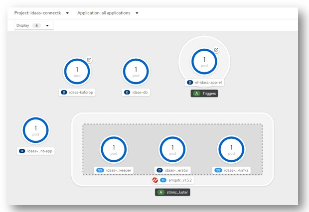

# idaas-connect-gitops
Deploy idaas connect using git-ops argocd

# Simple commands
```
kubectl delete Pipeline idaas-testingcomponent-pipeline  -n idaas-connectk  && kubectl delete PipelineRun idaas-pipeline-run-1  -n idaas-connectk

kubectl apply -f pipeline.yaml -n idaas-connectk && kubectl apply -f pipelinerun.yaml -n idaas-connectk && tkn pipelinerun logs idaas-pipeline-run-1  -f -n idaas-connectk      
 
kubectl delete Task build-echo -n idaas-connectk   && kubectl apply -f   build-echo-task.yaml

kubectl delete Task bud-push -n idaas-connectk   && kubectl apply -f bud-push-task.yaml

kubectl delete task maven -n idaas-connectk  && kubectl apply -f  maven-task.yaml


kubectl delete PipelineRun idaas-pipeline-run-1  -n idaas-connectk && kubectl apply -f pipelinerun.yaml -n idaas-connectk &&tkn pipelinerun logs idaas-pipeline-run-1  -f -n idaas-connectk    


kubectl delete Task build-echo -n idaas-connectk   && kubectl apply -f   build-echo-task.yaml

kubectl delete Task bud-push -n idaas-connectk   && kubectl apply -f bud-push-task.yaml

kubectl delete task maven -n idaas-connectk  && kubectl apply -f  maven-task.yaml

kubectl delete task get-code -n idaas-connectk  && kubectl apply -f  get-code-task.yaml

kubectl delete Pipeline idaas-testingcomponent-pipeline  -n idaas-connectk && kubectl apply -f pipeline.yaml -n idaas-connectk


kubectl delete PipelineRun idaas-pipeline-run-1  -n idaas-connectk && kubectl apply -f pipelinerun.yaml -n idaas-connectk && tkn pipelinerun logs idaas-pipeline-run-1  -f -n idaas-connectk

kubectl apply -f triggers.yaml -n idaas-connectk


kubectl delete TriggerTemplate idaas-app-tt -n idaas-connectk
kubectl delete TriggerBinding idaas-app-tb -n idaas-connectk
kubectl delete EventListener idass-app-el -n idaas-connectk
kubectl delete route idaas-app-el -n idaas-connectk
```

